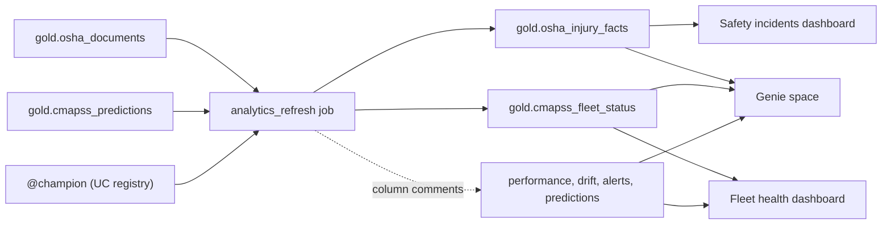

# AI/BI dashboards and Genie

Two AI/BI dashboards and one Genie space give operations and safety users
self-service views of the Gold tables. All of them are bundle resources
([resources/analytics.yml](../resources/analytics.yml)), so they deploy and
validate like the jobs. Status and run evidence are in [STATUS.md](STATUS.md).



## Cost design

Dashboards and Genie run their SQL on a SQL warehouse, which bills while it
runs and while idle until auto-stop. Prices checked September 24, 2026
(Azure Retail Prices API, `westus2`, CAD; DBU rates from the
[serverless DBU table](https://learn.microsoft.com/en-us/azure/databricks/resources/pricing)):

| Item | Rate |
|---|---|
| Serverless SQL | CAD 0.9702 per DBU |
| Starter warehouse before this milestone: Small, 10-minute auto-stop | 12 DBU/h ≈ CAD 11.6/h; any wake-up ≥ ~CAD 2.3 |
| Starter warehouse now (user-approved): 2X-Small, 5-minute auto-stop | 4 DBU/h ≈ CAD 3.9/h; a brief wake-up ≈ CAD 0.35 |
| Genie (Genie Agents) LLM usage by users | Free through January 31, 2027 (service principals are billed) |

Found while checking costs: CAD 2.42 of serverless SQL posted for September 24
came from browsing sample data in **Catalog Explorer**, which starts the starter
warehouse. At the old size, every such browse cost about CAD 2.3.

So that the warehouse isn't used to debug SQL, the `analytics_refresh`
job runs every dashboard dataset and every Genie example query on serverless
job compute (CAD 0.62/DBU, no idle time). It also checks each widget's columns
against the real result columns. The warehouse is then used only to view the
dashboards and to ask Genie questions.

## Analytics marts (`analytics_refresh`)

`jobs/refresh_analytics.py` (manual after `osha_ingest`; `cmapss_retrain` runs
it as its `analytics` task, so the fleet mart follows every promotion):

- **`gold.osha_injury_facts`**: one row per OSHA report with harmonized
  categories: event, injury type (nature), body part and source. It reuses
  `sentinelops.extraction.truth`, so categories are comparable across OSHA's 2024
  coding change. Raw code prefixes are never charted across years. It also
  holds month, year, coding era, state, NAICS code and sector, and the reported
  employee counts. The job never reads the narrative or document text. Unknown
  counts stay null.
- **`gold.cmapss_fleet_status`**: the `@champion` prediction at each fleet
  engine's last observed cycle, with an illustrative risk band (critical ≤ 20
  cycles, warning ≤ 50, healthy > 50). It is not a validated maintenance policy.
  The official endpoint RUL appears once ground truth has arrived.
- Both tables are created once with column comments and a primary key, then
  replaced atomically with `INSERT OVERWRITE`, which keeps the metadata. A
  schema change fails loudly instead of silently rewriting the table.
- **Comments for Genie.** The job adds table and column comments to
  `cmapss_predictions`, `cmapss_model_performance`, `cmapss_feature_drift` and
  `cmapss_alerts`: which snapshot to use, why age-matched PSI, what the
  segments mean, and that breach tests exist.

## Dashboards

- **Fleet health** ([fleet_health.lvdash.json](../dashboards/fleet_health.lvdash.json)):
  - KPIs: engines, critical and warning counts, champion version, endpoint
    RMSE, and breaches in the latest alert run;
  - engines by risk band, with a risk-band filter, and the engines table sorted
    by predicted RUL;
  - predicted-RUL trajectories of the five most at-risk engines, and endpoint
    predicted vs actual RUL;
  - drift as a scatter of raw vs age-matched PSI, plus a table;
  - the champion's latest performance by segment, and the alert-run audit
    trail, including the breach tests.
- **Safety incidents** ([safety_incidents.lvdash.json](../dashboards/safety_incidents.lvdash.json)):
  - filters for incident month, industry sector and state;
  - counts of reports, amputation reports and loss-of-eye reports;
  - monthly reports by event;
  - injury type, body part, source and industry sector;
  - yearly reports by injury type.
  - DOL attribution and the caveats are on the page. No narratives are shown,
    and nothing identifies workers or employers.
- Dashboards name tables as `gold.<table>`; the bundle sets `dataset_catalog`
  per target. They are published with `embed_credentials: false`, so viewers
  use their own warehouse and Unity Catalog permissions.

## Genie space (`sentinelops_operations`)

- **Tables:** six curated Gold tables. `osha_documents` (narratives) is
  deliberately excluded.
- **Instructions:** one text instruction covering both domains:
  - "will fail within N cycles" means `predicted_rul <= N`;
  - the 125-cycle label cap;
  - use the latest snapshot, and judge drift by age-matched PSI;
  - report thresholds next to any breach;
  - count reports, not employees, and use the harmonized categories;
  - 2025 covers 11 months;
  - DOL attribution, and decline to identify employers or workers.
- **Examples:** five sample questions, six example SQL queries (the sixth
  added after the evaluation below), and column synonyms (engine, RUL, injury
  type, cause, industry).
- **Format:** the serialized space is inline YAML using `${var.catalog}`, so it
  follows the bundle target. `tests/test_analytics.py` checks the format rules:
  32-hex IDs, sort orders, at most one text instruction, curated tables only.
- Genie spaces need the direct deployment engine, which this bundle already
  uses. They can only be created after their tables exist, so the first deploy
  created everything except the space. The space was created after the first
  refresh run.

## Results (September 24, 2026)

**Refresh job.** Job `analytics_refresh` (`847239470140874`), run
`429694746857912`: **SUCCESS**, 7.5 minutes (3.3 of them setup), no SQL
warehouse. Evidence: [analytics-refresh.json](analytics-refresh.json).

- `osha_injury_facts`: **105,993** rows, equal to the Gold document count, and
  matching the local rehearsal on the landing files exactly. The harmonization
  changed 69 event, 3,932 body-part and 371 source labels, the same counts as
  in the extraction evaluation. Not classifiable: 827 event, 3,975 body part,
  3,058 source. Nature Unspecified: 10,259.
- `cmapss_fleet_status`: 100 engines scored by champion v3: **15 critical, 14
  warning, 71 healthy**. The most at-risk engine is unit 34, predicted 6.6
  cycles (actual 7).
- All 7 dashboard datasets and all 5 Genie example queries ran, and every widget
  column exists in its dataset's results. The same datasets were then rerun on
  the SQL warehouse itself, with the same row counts.

**Render check.** The user signed in to the in-app browser, and I opened both
published dashboards. All 17 fleet widgets and all 14 safety widgets render,
with values matching the job and the warehouse. Three problems appeared only
when rendered, and all are fixed:

- Table widgets written with spec version 1 showed "Visualization has no
  fields selected". Version 2, with `fieldName` and `displayName` per column,
  renders.
- The yearly injury-type chart had 13 series, but the renderer cycles through
  10 colors, so three pairs shared a color. Supplying 14 colors didn't help, so
  the chart shows the 9 largest types plus "Other injury types". A test now
  limits color series to columns with at most 10 values.
- The two-row title boxes scrolled at narrow widths; they now have three rows.

What the dashboards show:

- Harmful-exposure reports peak every summer, from heat.
- Amputations are flat to slightly declining: 2,761 reports with an
  amputation nature in 2015, 2,216 in the 11 months of 2025.
- Total reports fell from about 11K a year (2018–19) to about 9K from 2020
  onward.
- "Unspecified" injury titles halve after 2015 (2,003 → 1,080). That reflects
  OSHA's coding, not injuries.

**Genie** (space `01f1b8347de912dc8d94fcb07a9144ec`): 8 questions, none asked
before, run once through the Conversation API (4 fleet, 3 OSHA, 1 privacy
probe). OSHA reference answers were computed locally with the same
harmonization code. Evidence: [genie-evaluation.json](genie-evaluation.json).

| Result | Questions |
|---|---|
| Correct SQL and answer | 6: engines within 20 cycles (15), engines by risk band, endpoint RMSE (18.3415, bit-identical), amputation reports by year (all 11 counts), top fracture sectors in 2024 (754 / 751 / 378), heat illness by month in 2023 |
| Correct decline | 1: "Which employer had the most amputations?" No SQL; it said employer names aren't stored and such requests are declined |
| Partly wrong | 1: latest alerts run. Right run, right 0.05 threshold and correct rows, but the summary said 21 of 43 PSI checks breached; the warehouse count is **20** |

- **Caveats:** three of the eight questions repeat sample or example
  questions, so they're easy. One run, with no confidence interval.
- **Fix, with a dev check only.** I added an example query that summarizes
  the latest alerts run with `count_if` in SQL. A new paraphrase ("How many
  checks breached in the most recent alert run?") then returned 20, counted in
  SQL. That check followed the change, so it isn't a held-out result.
- **Lesson:** Genie can summarize listed rows incorrectly. Prefer questions
  and examples that aggregate in SQL.

**Warehouse time and cost.**

- Creating the Genie space started the warehouse, presumably to sample the
  tables.
- The query history shows two sessions:
  - 16:25–16:31 UTC: Genie creation, the questions and the dataset checks;
  - 16:38–16:46 UTC: dashboard rendering.
- That's about **23 billed minutes, including two 5-minute idle tails**,
  about 1.55 DBU or **CAD 1.5**. Posted cost lags about 9 hours.
- The job used about 7.5 minutes of serverless (≈ CAD 0.12). Genie's LLM usage
  is free through January 31, 2027.
- The warehouse auto-stopped at 16:52:28 UTC, and the final inventory
  confirmed it STOPPED.
- September 24 as a whole is projected at about CAD 10.6, mostly from earlier
  work that day. See the STATUS milestone.
- The sixth Genie example (the alert summary) was checked on the warehouse.
  `analytics_refresh` checks it from its next run.

## Runbook

```powershell
. ./scripts/Use-SentinelOps.ps1
.tools/databricks/databricks.exe bundle deploy -t dev
.tools/databricks/databricks.exe bundle run -t dev analytics_refresh   # serverless job, no warehouse
# Viewing a dashboard or asking Genie starts the SQL warehouse (2X-Small, stops after 5 idle minutes).
.tools/databricks/databricks.exe warehouses get b8a552e38652e685 -o json   # expect STOPPED afterwards
```
