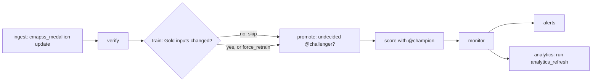

# Operational ML: promotion, fleet scoring and monitoring

This milestone puts the Gold-trained model into a batch operating loop. Real-time
serving is a bounded demo on the same Gold feature contract (see "Real-time
serving" below).

```mermaid
flowchart LR
    T[cmapss_train] -->|@challenger| P[cmapss_promote]
    P -->|validation gate| C[@champion]
    G[Gold features, fleet split] --> S[score task]
    C --> S
    S --> L[gold.cmapss_predictions]
    E[Official endpoint labels] --> M[monitor task]
    L --> M
    M --> L
    M --> R[gold.cmapss_model_performance]
    M --> D[gold.cmapss_feature_drift]
```

## Promotion gate (`cmapss_promote`)

`jobs/promote.py` evaluates the `@challenger` version and never reads official
test labels. It blocks promotion unless all of these hold:

- The version was trained from Gold (`training_source=gold_medallion` tag), and
  its signature equals the Gold feature contract (`sentinelops.model.FEATURES`).
- The Gold training labels still match the digest the challenger's run logged.
  The gate then recomputes a constant-mean baseline on the challenger's own
  held-out validation engines. The challenger's validation RMSE must be at most
  **0.5×** that baseline; the ratio was fixed before the first evaluation.
- If a champion exists, both must share subset, validation engines and label
  digest, and the challenger must match or beat the champion's validation RMSE
  (tolerance 0). If they aren't comparable, the gate rejects rather than guessing.

On success it moves `@champion`, removes `@challenger`, and tags the version with
`promotion_decision` and `promotion_reasons`. A rejection only writes those tags.
Validation RMSE comes from the model-selection step (fit on 80% of engines).
It measures the training procedure on unseen engines, not the refit model.

## Fleet scoring (`cmapss_score`, task `score`)

In this simulation the NASA **test engines play the in-service fleet**: their
trajectories stop before failure, like engines still flying. `jobs/score_fleet.py`
resolves `@champion` once, loads that exact version, and scores Gold feature rows
not yet logged for that version. Gold features are the same Spark computation
the model was trained on, which matters because the model is sensitive to the
~1e-12 Spark/pandas differences (see STATUS.md).

`gold.cmapss_predictions` is the inference log. Its composite key is
`(dataset, subset, split, unit, cycle, model_version)`. Writes are an
insert-only MERGE on that key, so reruns add nothing, and a newly promoted
version scores the whole fleet once. Each row records model name/version,
`scored_at` and the job run ID. `actual_rul` and `label_observed_at` stay null
until ground truth arrives.

## Delayed labels and monitoring (task `monitor`)

An engine's ground truth arrives with its official endpoint label. The true RUL
at an earlier cycle is then `endpoint RUL + (last cycle − cycle)`, uncapped.
`jobs/monitor_fleet.py` merges these labels into the log only where they are
missing. It then appends snapshots, each stamped with `computed_at` and the job
run:

- `gold.cmapss_model_performance`: rows, RMSE, MAE, NASA score and bias
  (positive means RUL is overestimated, the unsafe direction). Reported per
  model version and segment: `all`, `endpoint` (last cycle, i.e. the official
  benchmark), `actual_le_125`, and true-RUL buckets. The model was trained with
  labels capped at 125, so it underestimates healthy engines by design (bucket
  `rul_126_plus`). `all` mixes that in, and its NASA score is not meaningful.
- `gold.cmapss_feature_drift`: for each model input, PSI of fleet vs training
  features. Fleet engines are observed earlier in life than run-to-failure
  training data, so raw `psi` mostly measures age. `psi_age_matched` reweights
  the training reference to the fleet's cycle distribution and drops training
  rows outside the fleet's age range.

Because the fleet here is the benchmark test set, these metrics are operational
evidence only. They must not choose or promote models; the gate above does that.
Alert thresholds are checked by the `alerts` task of `cmapss_retrain` (below); there are no schedules.

## Orchestrated retraining (`cmapss_retrain`)

One manual job runs the whole loop in order, so nothing reads Gold while an
ingestion update is writing it:



- **Train only on change.** `train_medallion.py --only-if-changed` computes
  the digests of the Gold rows training would use and compares them with the
  `digest_features` and `digest_training_labels` params of the `@champion`
  training run. When both match, it exits cleanly without an MLflow run or a
  new version: retraining unchanged data would register an identical model,
  and the gate promotes on a tie. The job parameter `force_retrain=true`
  overrides this. Official test labels are not an input to the decision.
- **Promote only what's pending.** `promote.py --only-pending` exits cleanly
  when there is no `@challenger`, or when the challenger already has a
  `promotion_decision` tag, so a rejected version is never re-decided. The
  standalone `cmapss_promote` job keeps its strict behavior.
- **Why a linear chain rather than an If/else task.** Task values, which
  If/else conditions read, can only be set from notebooks. A notebook would run
  in a different serverless environment, and a different pandas version could
  change the digests, which would trigger false retrains. So each step decides
  for itself in the same pinned environment, and a skipped step still
  succeeds.
- **Dashboard marts refresh in the same run.** The `analytics` task runs the
  `analytics_refresh` job (a `run_job_task`, so the job is defined once), which
  rebuilds `gold.cmapss_fleet_status` from the current `@champion`. Before
  this, a promotion left the fleet dashboard showing the old version until
  someone ran the refresh by hand. It depends on `monitor`, beside `alerts`
  rather than after it: a threshold breach can't leave the marts stale, and a
  failed dashboard SQL check can't suppress an alert. Either failure fails the
  run.
  Verified in dev run `248147539009900` (SUCCESS, 30 min): the child run
  `129586591044115` ran in parallel with `alerts`, found the Genie space, ran
  every dashboard and Genie query and rebuilt the fleet mart for v3.
- **Limitation (environments):** `analytics_refresh` also rebuilds the OSHA
  mart, and only dev has OSHA data, so in staging or prod the `analytics` task
  fails. CI never runs `cmapss_retrain` there (staging runs only ingest and
  verify; prod is deploy-only).
- **Limitation:** `verify` asserts the FD001 benchmark's exact row counts. That
  is right for this static dataset, but a pipeline receiving genuinely new
  data needs growth rules there, or the chain stops at `verify`.
- **Verified on unchanged data**, run `599725542930474` (**SUCCESS**, 23.3
  min):
  - The pipeline update `c2bc60cc…` appended 0 rows to Bronze, and every
    downstream flow was `NO_OP`.
  - `verify` passed (its third verified run).
  - `train` recomputed the champion's digests exactly (`efdbf289f866a12d`,
    `bd98d8c49e59152c`) and skipped, registering nothing.
  - `promote` found no `@challenger`.
  - `score` had 0 pending rows.
  - `monitor` reproduced endpoint RMSE 18.341479192292436 bit-for-bit, with
    age-matched drift over 0.2 on 0 of 43 features.
  - `alerts` ran 47 checks with 0 breaches (worst PSI 0.102).
  - Ingest took 11.3 min and verify 9.3 (4.4 of it startup). The five later
    tasks took about 0.5 min each because they reused verify's warm serverless
    compute.
- The retrain branch (`force_retrain=true`, or real data changes) was not run
  in the cloud: the user chose not to register an identical v4. It runs the
  unchanged code of `cmapss_train` and `cmapss_promote`, which were verified
  in earlier milestones.

## Alerts (task `alerts`)

`jobs/check_alerts.py` evaluates the champion's monitoring snapshots against
thresholds fixed in advance (job parameters):

| Check | Default | Compared with |
|---|---|---|
| `rmse_increase` for the `endpoint` and `actual_le_125` segments | 0.2 (+20%) | The same model version's first snapshot, never test-set model selection |
| `psi_age_matched` per feature | 0.2 | The latest drift snapshot |
| `snapshot_age_hours` for performance and drift | 24 | Spark `current_timestamp()` |

Every check is appended to `gold.cmapss_alerts` (value, threshold, breached,
model version, job run), so the table is an audit trail. Any breach fails the
task and the job run. There are no email notifications yet (the user chose not
to add them); the failed run in the Jobs UI and the table are the signal.
Databricks SQL alerts were not used because they need warehouse time for every
evaluation.

**Breach test.** An alerts-only run (Jobs API `only: ["alerts"]`,
`max_psi=0.05`), run `955572570273055`, recorded 47 checks. 20 features
breached (age-matched PSI 0.052–0.099), and the task failed with every breach
listed. That is the intended signal. The run's lifecycle state reads
`INTERNAL_ERROR` with result `FAILED`, because the other tasks were disabled by
`only`.

**Retries found and fixed.** The first breach test (run `245262911606779`)
retried the failed task once, although every task sets `max_retries: 0`.
Serverless auto-optimization retries failed tasks by default, and both attempts
appended their checks. Every task in every job now sets
`disable_auto_optimization: true`, and `tests/test_bundle.py` enforces it; the
repeat test made exactly one attempt. Before this fix, a failed paid-model job
(`osha_answer_eval`, `osha_extraction_eval`, `osha_embed`) could have repeated
its model calls. No earlier run had actually failed that way.

## Real-time serving (bounded demo)

The model needs 10 cycles of history per engine, so a real-time contract must
either:

- accept Gold-format feature rows computed by the Spark pipeline, or
- look features up by engine key from a synced online store.

It must not recompute features with pandas. The demo uses the first option:
clients send rows of `gold.cmapss_features` in `sentinelops.model.FEATURES`
order as MLflow `dataframe_split` JSON. JSON floats round-trip doubles
exactly, so served predictions can be compared with the batch log bit for bit.

- **Endpoint** `sentinelops-rul-demo` ([infra/serving-endpoint.json](../infra/serving-endpoint.json)):
  - serves `turbofan_rul` v3 (the `@champion`) on a Small CPU (0–4
    concurrency) with scale-to-zero;
  - has an AI Gateway inference table, `sentinelops_dev.sentinelops_dev.turbofan_rul_demo_payload`.
- **Not a bundle resource.** The endpoint bills while it's provisioned, so
  it is created for a demo and deleted afterwards:

  ```powershell
  .tools/databricks/databricks.exe serving-endpoints create --json '@infra/serving-endpoint.json' --no-wait
  .tools/databricks/databricks.exe bundle run -t dev cmapss_serving_check
  .tools/databricks/databricks.exe serving-endpoints delete sentinelops-rul-demo
  ```

- **Parity job** `cmapss_serving_check` (`jobs/check_serving.py`) sends every
  fleet row of the Gold features to the endpoint in batches of 400. It fails
  unless every prediction is bit-identical to `gold.cmapss_predictions` for
  the served version, and that version is the `@champion`. It also measures
  single-row latency on the engines closest to failure, and checks that the
  requests reached the inference table. Retries on 429/502/503/504 (cold
  starts) are recorded in its report.
- **Cost:**
  - CPU serving is 1 DBU/h per unit of provisioned concurrency, at CAD 0.097
    per DBU, so Small costs at most about CAD 0.39/h while scaled up, and
    nothing at zero;
  - inference tables cost 7.143 DBU per GB of payload (about CAD 0.01 here);
  - scale-to-zero means a cold start on the first request, and it isn't
    recommended for production.

**Results (September 24, 2026).** Evidence: [serving-demo.json](serving-demo.json).

- **Provisioning:** created at 17:16 UTC and READY about 10 minutes later.
  Most of that time was the container build.
- **Parity:** run `1018787913287976` **SUCCESS**. All **13,096** fleet rows
  are **bit-identical** to `gold.cmapss_predictions` for v3 (maximum absolute
  difference 0.0). The served version is the `@champion`. For example, engine
  34 at cycle 203 is served as 6.635345210981352 cycles, the same as the
  batch log.
- **Latency, warm endpoint, called from a serverless job in the same
  region:**
  - batches of 400 rows: p50 250 ms, p95 293 ms (33 calls);
  - single rows: p50 81 ms, p95 85 ms (20 calls);
  - no retries were needed.
- **A mistake, caught by the check:** the first run, `959774648252926`,
  failed. `cycle` is both a Gold key and the first model feature, so selecting
  keys plus features repeated it, and every request row was shifted by one
  column. The endpoint accepted and scored those 33 misaligned requests,
  because the types still matched the signature. The job then failed on a
  pandas merge. The job now selects `cycle` once, and `request_body` rejects
  duplicate column labels (a test covers it).
  - **Lesson:** schema enforcement doesn't catch a column shift between
    same-typed features. Rehearse the job's own frame handling locally before
    the cloud run.
- **Inference table:** every request was logged, with status 200, no logging
  errors, and 3–17 ms of model execution per request.
  - The failed run's 33 requests landed at 17:34–17:35 and are identifiable
    by time.
  - The parity run's 53 requests (13,116 predictions) landed at 17:44.
  - Delivery wasn't fast: the rows were absent 4 minutes after the run and
    present 40 minutes later. No `_otel_logs` table was created, so this
    endpoint used standard delivery, not the fast CPU path the docs describe.
  - The check job's 3-minute wait was therefore too short. Treat inference
    tables as delayed evidence, not a synchronous check.
- **Deleted** at 18:28 UTC. No custom serving endpoints remain; the inference
  table is kept.
- **Cost (estimate):**
  - serving: at most ~CAD 0.35, since it scaled to zero after 30 idle
    minutes;
  - check job: about CAD 0.30 across both runs;
  - inference table: about CAD 0.02;
  - warehouse checks of the inference table: about CAD 0.7.

## Runbook

```powershell
. ./scripts/Use-SentinelOps.ps1
# After cmapss_train registers a new @challenger:
.tools/databricks/databricks.exe bundle run -t dev cmapss_promote
# Score new fleet rows with @champion, merge labels, snapshot metrics:
.tools/databricks/databricks.exe bundle run -t dev cmapss_score
```

All jobs are manual, STANDARD performance, one concurrent run, and zero retries
(including serverless auto-optimization retries). `cmapss_retrain` runs the whole
loop; run it with `bundle run -t dev cmapss_retrain` (about 23 minutes on unchanged
data), or pass `--params force_retrain=true` to retrain regardless of the digests.
`cmapss_promote` has a 600-second limit; `cmapss_score` has 1,200 seconds
(600 per task).
